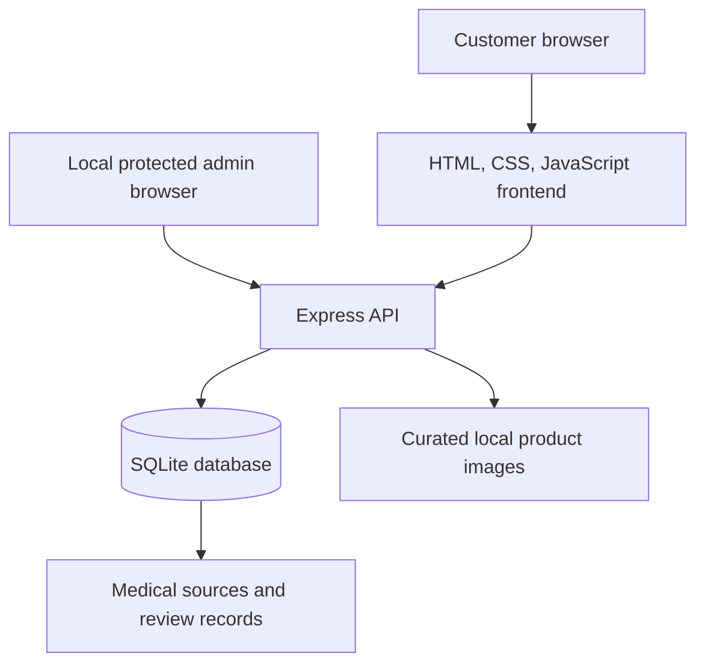

# Grace Care Pharmacy Catalogue

A database-backed medicine discovery, wholesale ordering, and availability-inquiry system designed for Sierra Leone and West African pharmacy workflows. It combines an honest catalogue, reviewed product imagery, source-aware medicine records, a wholesale carton cart with server-verified calculations, order requests, persistent inquiries, and a local-only review console.

> This is a catalogue, identification, and wholesale request tool. It does not diagnose, recommend treatment, calculate doses, process payments, or confirm orders. Order requests are stored as "pending verification" and require pharmacy review.

## Problem and audience

Customers need to identify a medicine package and ask whether it is available without being shown fabricated stock, public pricing, or unsupported medical claims. Pharmacy staff need a private workflow for reviewing uncertain images, citations, product metadata, and inquiries.

Primary audiences:

- Customers in Sierra Leone seeking product identification and availability confirmation
- Pharmacy staff maintaining the catalogue
- Portfolio reviewers evaluating the product, engineering, accessibility, and safety decisions

## Architecture



Everything runs from the same Express application and port. The SQLite database is the source of truth; the customer frontend contains no hardcoded product catalogue.

## Technology stack

- Node.js 24+
- Express 5
- Node's built-in SQLite driver
- Zod request validation
- Helmet security headers
- Restricted CORS and rate limiting
- Plain semantic HTML, CSS, and JavaScript
- SHA-256 duplicate detection
- `image-size` for imported image dimensions

## Database schema

- `products`: medicine identity, reviewed medical fields, availability, review state, and wholesale fields (units per box, boxes per carton, minimum/available cartons, price per carton in cents, pricing mode, wholesale status, packaging review status)
- `product_images`: paths, hashes, dimensions, angles, sequence order, verification, OCR fields, and source/license review
- `medicine_facts`: structured, source-linked facts with review state
- `sources`: organization, title, URL, access date, and source type
- `review_queue`: uncertain image and metadata decisions
- `inquiries` and `inquiry_items`: persistent customer inquiries with reference numbers, reasons, destinations, carton quantities, and packaging/price snapshots taken from the database at submission time
- `orders` and `order_items`: wholesale order requests with reference numbers, statuses, and server-computed line snapshots
- `import_runs`: repeatable importer summaries

Retail pricing remains deliberately absent. Wholesale pricing exists only per carton, only when an administrator enters a supplier-confirmed value, and no payment is ever processed.

## Wholesale ordering flow

1. Customers search by generic name, brand, active ingredient, strength, dosage form, or manufacturer (multi-word queries narrow results).
2. The product page lists sibling variations (same generic name) as separate exact records and shows a carton calculator only when the packaging review status is **confirmed**: cartons × boxes per carton, unit totals, price per carton, and estimated subtotal.
3. The guest cart stores only product IDs and carton quantities in the browser. Names, packaging, prices, availability, and totals are always recalculated server-side (`POST /api/cart/verify`) and again at submission. Browser-sent prices are ignored.
4. Checkout is a safe order-submission flow: every line is revalidated (product exists, wholesale enabled, direct checkout enabled, fixed price, minimum met, stock sufficient), then stored as `pending_verification` with a reference number. Statuses progress through quote_requested, awaiting_payment, payment_confirmed, processing, shipped, delivered, or cancelled in the review console.
5. Quote-required, out-of-stock, by-request, or unconfirmed-packaging products route to inquiries: single-product (from the product page dialog) or full-cart quotation requests, both prefilled with product data and stored with snapshots.

Availability states: in_stock, low_stock, out_of_stock, available_by_request, preorder, quote_required, temporarily_unavailable, discontinued. When packaging is unverified the interface says **"Packaging details require confirmation"** instead of inventing carton math.

Because no supplier-confirmed packaging or pricing exists yet for the 100 real records, all of them remain inquiry-only until staff confirm values in the review console. `npm run seed:fixtures` creates five clearly labeled `[DEV FIXTURE]` products (slug prefix `fixture-`, category "Development fixtures") to exercise the full flow; remove them with `npm run seed:fixtures -- --remove`. Fixtures never touch real records.

## Image-curation process

`npm run import-products` scans `.product_image_candidates` recursively and:

1. Migrates all 100 medicine records.
2. Normalizes the folder-to-product mapping from the reviewed legacy catalogue.
3. Computes a SHA-256 hash for every supported image.
4. Skips exact duplicates globally.
5. Stores dimensions and public/local paths.
6. Keeps previously reviewed primary images public.
7. Places folder-only matches in the private review queue.
8. Leaves license status pending until a reviewer confirms it.
9. Produces a JSON summary and can be rerun without duplicate records.

Current audited import:

- 100 products
- 746 discovered files
- 743 unique image records
- 3 duplicate occurrences skipped
- 658 uncertain candidates queued
- 85 products with one reviewed public image
- 15 products without a reviewed image
- 0 verified multi-view products
- 0 verified 360 sequences

Folder membership is not treated as proof that two packages are the same exact product. Different brands, strengths, forms, manufacturers, and pack sizes must remain separate unless a reviewer establishes an exact match.

## Product viewer logic

The reusable viewer selects its mode from reviewed database records:

- **360° View:** at least 12 reviewed images and every image has an ordered sequence index. Includes preload progress, drag/swipe, arrows, keyboard control, play/pause, zoom, fullscreen, and reduced-motion handling.
- **Multi-View Product Gallery:** 2–11 reviewed images. Includes thumbnails, labels, counter, drag/swipe, arrows, keyboard control, adjacent-image preload, zoom, and fullscreen.
- **Single Product Image:** exactly one reviewed image. Includes restrained pointer tilt, high-resolution zoom, fullscreen, shadow, and depth. It explicitly states that unseen package sides are unavailable.
- **Image review pending:** no reviewed image.

The system never generates an imaginary package back or labels a single photograph as a 360° view.

## Medicine-information sourcing

The database includes the official [Sierra Leone Ministry of Health and Sanitation National Essential Medicines List, 2021](https://mohs.gov.sl/download/71/parmaceutical-service/18079/national-essential-medicines-list_sierra_leone-2021-edition.pdf), archived locally under `data/sources/` for repeatable import review.

An optional `npm run enrich:dailymed` workflow searches the official [DailyMed web services](https://dailymed.nlm.nih.gov/dailymed/app-support-web-services.cfm). Matches are stored as private candidates, not published automatically. A reviewer must confirm the exact medicine, formulation, and label before changing a fact to `reviewed`.

Unknown medical fields display **“Verified information is not yet available.”** OCR fields exist as review aids but are never published automatically.

## Medical-safety decisions

- No individualized recommendations or diagnosis
- No dose calculations or start/stop instructions
- No fabricated strengths, manufacturers, indications, or regulatory claims
- Antibiotic and prescription-supervision notices
- Visible source and review states
- Explicit distinction between a stored inquiry and a confirmed order
- Public API returns only reviewed facts and reviewed images

## Accessibility

- Semantic headings, links, buttons, forms, and landmarks
- Skip links and visible focus states
- Keyboard-operable viewer and gallery
- Touch swipe support without requiring drag as the only input
- Descriptive image alternatives
- Live search and form-status messages
- Fullscreen and zoom controls with accessible names/states
- Responsive layouts down to 320px
- `prefers-reduced-motion` support

## Security controls

- Localhost binding by default
- Helmet security headers and restrictive content policy
- Same-origin frontend/API deployment
- Restricted CORS allowlist
- JSON request-size limit
- General and inquiry-specific rate limits
- Zod server-side validation
- Parameterized SQLite statements
- Duplicate-inquiry protection
- Curated-directory path containment for image assignment
- Generic production error responses without stack traces
- Admin Basic authentication from `.env`
- Remote admin denial by default, including tunneled requests
- Database, `.env`, and credentials excluded from source control

## Local setup

PowerShell:

```powershell
cd "C:\Users\osman\OneDrive\Desktop\pharmacy"
Copy-Item .env.example .env
# Edit .env and replace ADMIN_PASSWORD with a long random password.
npm install
npm run migrate
npm run import-products
npm start
```

Open:

- Frontend: <http://localhost:3000>
- API health: <http://localhost:3000/api/health>
- Local admin: <http://localhost:3000/admin>

The Basic Authentication username may be any non-empty value; the password is `ADMIN_PASSWORD` from the local `.env` file.

Development mode with automatic restart:

```powershell
npm run dev
```

## Commands

```text
npm run dev               Start with file watching
npm start                 Start normally
npm run migrate           Apply the database schema
npm run seed              Import products and images
npm run import-products   Repeatable product/image import
npm run enrich:dailymed   Store private DailyMed label candidates
npm run seed:fixtures     Create dev-only wholesale fixture products (-- --remove deletes them)
npm test                  Run API and persistence tests
```

## Public API

| Method | Route | Purpose |
|---|---|---|
| GET | `/api/health` | Application and database health |
| GET | `/api/products` | Paginated catalogue and filters |
| GET | `/api/products/:slug` | Detailed reviewed product record |
| GET | `/api/products/:slug/images` | Viewer mode and reviewed images |
| GET | `/api/categories` | Category counts |
| GET | `/api/search?q=` | Catalogue search |
| POST | `/api/inquiries` | Persist an availability or wholesale inquiry (rate-limited, deduplicated) |
| POST | `/api/cart/verify` | Server-side cart recalculation: packaging math, pricing, stock, and checkout eligibility |
| POST | `/api/orders` | Store a revalidated wholesale order request as `pending_verification` (rate-limited, deduplicated) |
| GET | `/api/sources/:id` | Source record |

Protected routes under `/api/admin` support product creation/editing (including wholesale packaging, stock, and pricing fields), safe image assignment, image review, import, review queue decisions, inquiry review with per-item snapshots, order review and status updates, and catalogue export.

## Private admin review workflow

1. Set `ADMIN_PASSWORD` in `.env`.
2. Open <http://localhost:3000/admin>.
3. Select a product and compare every candidate to the exact product identity.
4. Label the real angle, set order, and approve the image only after checking brand, ingredient, strength, form, manufacturer, and pack size.
5. Add ordered sequence indexes only for a genuine spin sequence.
6. Review medical sources before publishing facts.

OCR text and confidence are stored as private fields. OCR is an aid, never an authority.

## Sharing with two reviewers

Never open a router port or bind the application directly to the public internet.

### Option 1: temporary preview

Install Cloudflare Tunnel once:

```powershell
winget install --id Cloudflare.cloudflared
```

With `npm start` still running in one terminal, use another:

```powershell
.\scripts\start-preview.ps1
```

The command prints a temporary HTTPS URL. The local computer, Node application, and tunnel terminal must remain running. Stop the tunnel with `Ctrl+C`.

This quick URL is unlisted but not identity-restricted. Use it only for brief, non-sensitive customer-interface review. Remote admin remains denied.

### Option 2: restricted two-person review

This requires a Cloudflare account and a domain in that account:

```powershell
cloudflared tunnel login
cloudflared tunnel create grace-care-review
cloudflared tunnel route dns grace-care-review review.your-domain.example
cloudflared tunnel run grace-care-review
```

Keep the real configuration in `%USERPROFILE%\.cloudflared\config.yml`, using `docs/cloudflared-config.example.yml` as a guide.

In Cloudflare Zero Trust:

1. Open **Access → Applications → Add application → Self-hosted**.
2. Enter `review.your-domain.example`.
3. Create one **Allow** policy.
4. Under **Include**, choose **Emails** and enter the two reviewer email addresses.
5. Enable email one-time PIN as the identity provider.
6. Do not create any broad allow rule. Everyone else is denied by default.
7. Keep `/admin` local; the server also rejects admin requests carrying proxy headers unless `ALLOW_REMOTE_ADMIN=true` is deliberately set.

Do not put reviewer addresses, tunnel credentials, or account IDs in this repository. A development tunnel is not permanent production hosting.

## Testing

```powershell
npm test
```

The suite covers health, catalogue data, search, categories, product images, viewer classification, validation, stored inquiries, duplicate prevention, protected admin access, review decisions, and restart persistence, plus the wholesale layer: carton/box/unit calculation, minimum and stock enforcement, quote-required and unconfirmed-packaging behavior, server-side repricing that ignores browser-sent prices, order creation and rejection, inquiry snapshots, and admin order status management.

Browser QA (requires Chrome, fixtures seeded, and the server running):

```powershell
node --no-warnings scripts/ui-test.js            # catalogue, viewer, drawer, responsive
node --no-warnings scripts/ui-test-wholesale.js  # search → calculator → cart → inquiry → checkout, mobile, keyboard
```

## Troubleshooting

- **`admin_not_configured`:** create `.env` and set `ADMIN_PASSWORD`.
- **Port already in use:** set another port in `.env`, for example `PORT=3100`.
- **Images do not load:** rerun `npm run import-products` and confirm `.product_image_candidates` remains in the project root.
- **Database reset for local development:** stop the server, move `data/pharmacy.db` to a safe backup location, then rerun migration/import. Do not delete a database containing inquiries without a backup.
- **Tunnel command missing:** install `cloudflared`, reopen PowerShell, and retry.
- **Tunnel works but admin is blocked:** expected behavior; admin is local-only by default.

## Known limitations and roadmap

- The current curated set has no verified true 360 sequence and no exact-product multi-view set yet.
- 658 candidate images require manual exact-product review.
- Fifteen products have no reviewed image.
- Most detailed medical fields remain unavailable until source-by-source clinical review is completed.
- Package OCR is represented in the schema/admin workflow but no OCR engine is bundled.
- A future production deployment should use managed identity, encrypted backups, audit logs, and a managed database.
- True 360 capture should use a controlled turntable workflow or verified GLB/GLTF model supplied by the manufacturer.

## Portfolio screenshots

Screenshots generated from the locally running application are stored under `docs/screenshots/` after the visual QA workflow.
